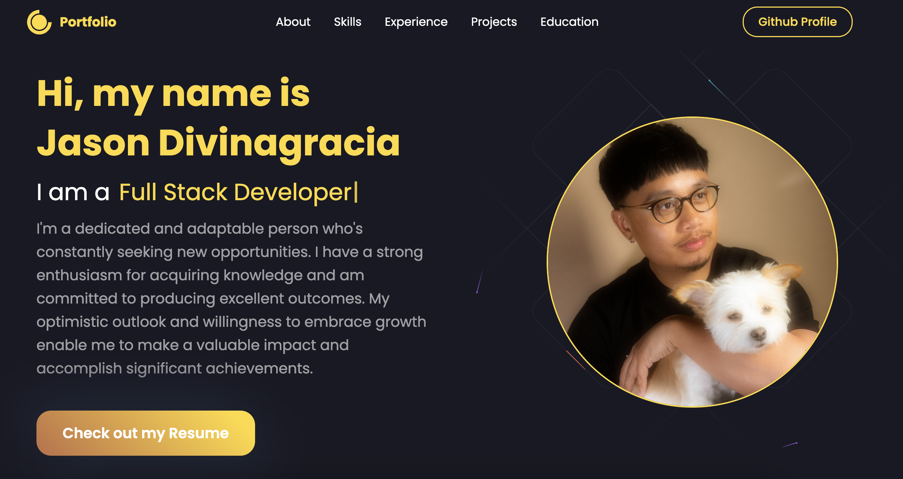

<h1 align="center">
  <br>
    Personal Web Portfolio
  <br>
</h1>

<h4 align="center">
  Built with 
  <a href="https://reactjs.org/">React</a>. It serves as an online portfolio to showcase my skills, experience and achievements. It also displays an overview of my background and projects that I have made.
</h4>

<p align="center">
  • <a href="#deployed">Deployed</a> •
  • <a href="#image">Images</a> •
  <a href="#setup">Setup</a> •
  <a href="#dependencies">Dependencies</a> •
</p>

## Deployed
[](https://app.netlify.com/sites/jason-divinagracia/deploys)
[Link to my Website](https://jason-divinagracia.netlify.app/)
## Images


## Setup

1. Clone the repository
```sh
git clone https://github.com/jsnmarkd/react-portfolio.git
```
2. Navigate to the project directory
```sh
cd react-portfolio
```
3. Install the dependencies
```sh
npm install
```
4. Start the server
```sh
npm start
```

## Dependencies

- [React](https://reactjs.org/)
- [MUI](https://mui.com/)
- [Style-Components](https://styled-components.com/)
- [emailjs](https://www.emailjs.com/)